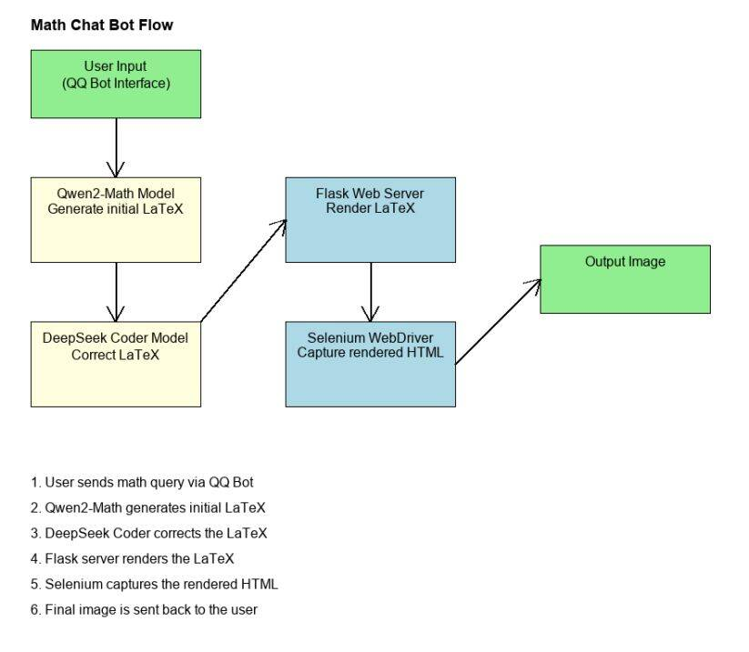
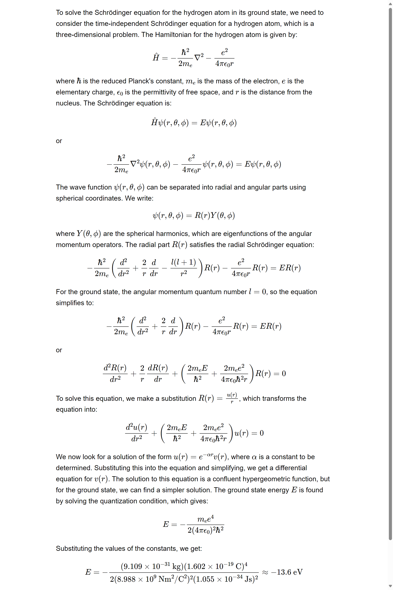

# Former Notes

## 1. ASR_LLM_TTS.md

**日期:** 2024-09-22  
**标签:** LLM角色扮演, LLM, TTS, ASR

这是一个基于关键词检测、语音识别、语音合成和对话生成的智能语音助手系统。该系统能够通过特定的唤醒词（如"hey bro"）启动与用户的语音对话，并利用先进的自然语言处理技术提供智能回复。

### 主要功能

1. **关键词检测：** 使用 Porcupine 实时监听唤醒词，启动对话。
2. **语音录制和检测：** 采用 WebRTC VAD 进行语音活动检测，录制有效语音片段。
3. **语音识别（ASR）：** 使用 SenseVoice Small 模型将录制的语音转换为文本。
4. **对话生成：** 调用 Ollama API（兼容 OpenAI API），根据上下文生成助手的文本回复。
5. **语音合成（TTS）：** 将助手的回复通过语音合成输出，模拟人声对话。
6. **对话历史保存：** 定期将对话内容保存为 JSON 文件，便于后续分析。

### 技术栈

- Python
- Porcupine（关键词检测）
- WebRTC VAD（语音活动检测）
- SenseVoice Small（语音识别）
- Ollama API（对话生成）
- GPT-SoVITS（语音合成）
- PyAudio, NumPy, SciPy（音频处理）

#### TTS部分

本项目基于 GPT-Sovits-v2，感谢开源社区工作者的贡献！

##### GPT-SoVITS TTS 项目

这是一个基于 GPT-SoVITS API 的文本到语音（TTS）项目。该项目允许用户根据不同的情感生成和播放语音，使用预定义的参考音频来影响输出的语音风格。

###### 功能特点

- 支持多种情感的语音生成（高兴、抑郁、激动、平静、纠结）
- 使用参考音频来控制语音风格
- 实时生成并播放 WAV 格式的音频文件
- 可自定义文本输入和输出文件名
- 提供 TTS 处理时间统计
- 可以添加一个情感识别模型来决定参考音频，从而控制音频合成情感（to do）

### 使用指南

1. 克隆仓库：
```bash
git clone https://github.com/HaxxorCialtion/ASR_LLM_TTS_py.git
cd intelligent-voice-assistant
```

2. 安装依赖：
```bash
pip install -r requirements.txt
```

3. 准备必要的 API 密钥和模型：
   - 获取 Porcupine API 密钥
   - 下载 SenseVoice Small 模型文件
   - 确保 Ollama API 服务已经运行
   - 开启 GPT-Sovits API 服务

4. 配置系统：
   - 在脚本中填入 Porcupine API 密钥
   - 设置 ASR 模型路径
   - 配置 Ollama API 端点（默认为本地）
   - 配置 GPT-sovits 模型和参考音频

### 使用方法

1. 运行主脚本：
```bash
python main.py
```

2. 等待系统提示："Listening for wake word..."
3. 说出唤醒词（默认为"hey bro"）开始对话
4. 与语音助手进行自然语言交互
5. 超时则需再次触发
6. 结束本轮对话即自动保存对话记录

### 主要特性

- 实时语音交互
- 智能对话生成
- 自然语音合成
- 长时间无语音自动休眠
- 对话历史记录

### 自定义设置

- 修改 `settings` 变量来自定义助手的角色和背景
- 调整 `max_silence_duration` 和 `min_speech_duration` 等参数来优化语音检测
- 更换唤醒词和对应的模型文件

### 许可证

本项目采用 MIT 许可证 - 查看 LICENSE 文件了解详情。

### 联系方式

项目维护者：HaxxorCialtion - cialtion@outlook.com  
Bilibili 视频地址：[BV1pftreQEbu](https://www.bilibili.com/video/BV1pftreQEbu)

### 致谢

- [Porcupine](https://github.com/Picovoice/porcupine) - 用于唤醒词检测
- [SenseVoice](https://github.com/FunAudioLLM/SenseVoice) - 提供 ASR 模型
- [Ollama](https://github.com/ollama/ollama) - 本地大语言模型服务
- [LLM](https://github.com/QwenLM/Qwen2.5) - LLM 服务
- [GPT-SoVITS](https://github.com/RVC-Boss/GPT-SoVITS) - 用于语音合成

---

## 2. ASR_LLM_TTS_理论高效版.md

**日期:** 2025-4-28  
**标签:** ASR, LLM, TTS, LLM边缘AI应用

# ASR-LLM-TTS 高效语音对话系统

一个高性能语音交互系统，使用 Faster-Whisper-Turbo、vLLM 和 F5-TTS (TensorRT)

## 系统架构

### ASR（语音识别）
- 使用 Faster-Whisper-Turbo 模型
- CUDA 加速，FP16 精度
- 内置 VAD 过滤功能

### LLM（大型语言模型）
- 使用 vLLM 部署
- 本地 REST API 接口
- 高吞吐量推理引擎

### TTS（语音合成）
- F5-TTS 的 TensorRT 优化版本
- 支持参考音频克隆
- 并行处理多段文本

## 主要特性

### 高效语音处理
使用静音检测和 VAD 技术实现高效录音，减少响应延迟。系统会缓存 300ms 的音频以捕捉完整语音起始。

### 并行 TTS 处理
文本分段处理和并行合成，首段优先播放，其余部分并行处理，显著提高响应速度。

### 性能监控
内置性能计时器，记录各个处理阶段的耗时，便于性能分析和优化。

### 日志记录
自动保存输入音频和输出合成语音，便于追踪和分析系统行为。

## 代码详解

### 导入依赖

```python
import os
import time
import wave
import numpy as np
import requests
import soundfile as sf
import pyaudio
import datetime
import threading
import queue
import concurrent.futures
from pathlib import Path
from faster_whisper import WhisperModel
from openai import OpenAI
import sounddevice as sd
```

### 系统配置

```python
# 音频参数
CHUNK = 1024
FORMAT = pyaudio.paFloat32
CHANNELS = 1
RATE = 16000
SILENCE_THRESHOLD = 0.01
SILENCE_DURATION = 0.8  # 降低静音判断时间以加快响应速度

# ASR模型路径
ASR_MODEL_PATH = "./whisper_turbo"

# LLM API
LLM_BASE_URL = "http://localhost:6001/v1"
LLM_API_KEY = "token-abc123"
LLM_MODEL_PATH = "./Qwen/Qwen2___5-3B-Instruct-AWQ"

# TTS服务
TTS_SERVER_URL = "localhost:8000"
TTS_MODEL_NAME = "f5_tts"
REFERENCE_AUDIO_PATH = "./tts/原来如此，你将见过的景物进行了这样的组合。.wav"
REFERENCE_TEXT = "原来如此，你将见过的景物进行了这样的组合。"

# 日志文件夹
INPUT_LOG_FOLDER = "./input_logs"
OUTPUT_LOG_FOLDER = "./output_logs"

# 性能优化参数
MAX_WORKERS = 4  # 线程池最大工作线程数
BATCH_SIZE = 3  # TTS并行合成的批次大小
```

### 性能计时器类

```python
class PerformanceTimer:
    def __init__(self):
        self.timers = {}
        self.start_times = {}

    def start(self, name):
        self.start_times[name] = time.time()

    def stop(self, name):
        if name in self.start_times:
            elapsed = time.time() - self.start_times[name]
            if name not in self.timers:
                self.timers[name] = []
            self.timers[name].append(elapsed)
            print(f"⏱️ {name} 用时: {elapsed:.4f} 秒")
            return elapsed
        return 0

    def get_average(self, name):
        if name in self.timers and self.timers[name]:
            return sum(self.timers[name]) / len(self.timers[name])
        return 0

    def print_stats(self):
        print("\n===== 性能统计 =====")
        for name, times in self.timers.items():
            if times:
                avg = sum(times) / len(times)
                max_time = max(times)
                min_time = min(times)
                print(f"{name}: 平均 {avg:.4f}秒, 最小 {min_time:.4f}秒, 最大 {max_time:.4f}秒, 共 {len(times)} 次")
```

### TTS 客户端类

```python
class FastTTSClient:
    def __init__(self, server_url=TTS_SERVER_URL, model_name=TTS_MODEL_NAME):
        self.server_url = f"http://{server_url}/v2/models/{model_name}/infer"
        self.session = requests.Session()
        self.reference_audio_path = REFERENCE_AUDIO_PATH
        self.reference_text = REFERENCE_TEXT
        self.samples, self.lengths = self.load_reference_audio(self.reference_audio_path)
        self.text_splitter = TextSplitter()
        self.audio_queue = queue.Queue()
        self.is_playing = False
        self.executor = concurrent.futures.ThreadPoolExecutor(max_workers=MAX_WORKERS)
        self.response_cache = {}  # 缓存TTS响应
        self.timer = PerformanceTimer()
        self.warmup()

    @staticmethod
    def clean_text(text: str) -> str:
        """清理文本中的特殊字符和不必要的空白"""
        text = text.replace('\n', ' ')
        text = text.replace('\t', ' ')
        text = ' '.join(text.split())
        special_chars = ['\r', '\xa0', '\u3000', '\u200b', '\u200c', '\u200d', '*'] + [f"{i}." for i in range(10)]
        for char in special_chars:
            text = text.replace(char, '')
        return text.strip()

    def synthesize_and_play(self, text: str):
        self.timer.start("TTS总耗时")

        # 清理文本
        cleaned_text = self.clean_text(text)

        # 分割文本为多个片段
        self.timer.start("文本分割")
        segments = self.text_splitter.split_text(cleaned_text)
        self.timer.stop("文本分割")

        if not segments:
            return

        # 创建时间戳用于音频文件命名
        timestamp = datetime.datetime.now().strftime("%Y%m%d_%H%M%S")

        # 重置播放状态和队列
        with self.audio_queue.mutex:
            self.audio_queue.queue.clear()
        self.is_playing = True

        # 启动播放线程
        player = threading.Thread(target=self.player_thread)
        player.daemon = True
        player.start()

        # 存储合成结果的有序字典，按索引存储，确保按顺序播放
        segment_results = {}
        segment_done = threading.Event()

        # 跟踪当前应该处理的段落索引
        next_segment_index = 0
        segments_total = len(segments)

        # 处理并播放第一个分段，确保快速开始
        self.timer.start("首段合成")
        first_audio = self.synthesize_segment_sync(segments[0], timestamp, 0, segments_total)
        self.timer.stop("首段合成")

        if first_audio is not None:
            self.audio_queue.put(first_audio)
            next_segment_index = 1

        # 如果还有更多分段，启动并行处理
        if next_segment_index < segments_total:
            # 省略部分并行处理代码...

        # 标记播放完成
        self.is_playing = False

        # 等待播放线程结束
        player.join()

        self.timer.stop("TTS总耗时")
        print("🔊 所有语音片段播放完成")
```

### TextSplitter 类

```python
class TextSplitter:
    def __init__(self):
        # 定义分隔符及其优先级（数字越大优先级越高）
        self.separators = {
            '。': 5,
            '！': 5,
            '？': 5,
            '；': 4,
            '\n': 4,
            '，': 3,
            '：': 3,
            '』': 2,
            ' ': 1
        }
        # 减少目标token长度以加快TTS响应
        self.target_length = 30
        # 搜索窗口大小
        self.window_size = 10

    def find_best_split_position(self, text, start_pos, target_pos):
        """在目标位置附近寻找最佳分割点"""
        best_pos = -1
        best_priority = -1

        # 在目标位置前后的窗口内寻找最佳分割点
        search_start = max(start_pos, target_pos - self.window_size)
        search_end = min(len(text), target_pos + self.window_size)

        for i in range(search_start, search_end):
            if i >= len(text):
                break

            char = text[i]
            if char in self.separators:
                priority = self.separators[char]
                if priority > best_priority:
                    best_pos = i
                    best_priority = priority

        # 如果没找到合适的分割点，就在目标位置处强制分割
        if best_pos == -1:
            return target_pos

        return best_pos + 1  # 返回分隔符后的位置

    def split_text(self, text):
        """将文本分割成较小的片段"""
        if not text or len(text.strip()) == 0:
            return []

        segments = []
        start = 0

        while start < len(text):
            # 省略部分分割逻辑...

        return segments
```

### AudioRecorder 类

```python
class AudioRecorder:
    def __init__(self, timer):
        self.p = pyaudio.PyAudio()
        self.stream = None
        self.frames = []
        self.is_recording = False
        self.silence_frames = 0
        self.is_speaking = False
        self.timer = timer

        # 优化音量检测参数
        self.volume_threshold = 0.015  # 稍微降低阈值提高灵敏度
        self.min_speak_frames = int(0.15 * RATE / CHUNK)  # 减少最少说话帧数(150ms)
        self.pre_buffer = []  # 预缓冲区
        self.pre_buffer_size = int(0.3 * RATE / CHUNK)  # 减少预缓冲(300ms)以降低延迟
        self.speak_frames = 0  # 说话帧计数

        # 波形能量计算的滑动窗口
        self.energy_window_size = 10
        self.energy_window = []

    def process_audio(self):
        if not self.stream:
            return False

        data = np.frombuffer(self.stream.read(CHUNK), dtype=np.float32)

        # 计算当前帧的能量
        energy = np.sqrt(np.mean(data ** 2))

        # 更新能量窗口
        self.energy_window.append(energy)
        if len(self.energy_window) > self.energy_window_size:
            self.energy_window.pop(0)

        # 使用滑动窗口平均能量进行更稳定的检测
        avg_energy = np.mean(self.energy_window) if self.energy_window else energy

        # 省略后续语音检测处理逻辑...

        return False
```

### 主函数

```python
def main():
    # 创建日志文件夹
    os.makedirs(INPUT_LOG_FOLDER, exist_ok=True)
    os.makedirs(OUTPUT_LOG_FOLDER, exist_ok=True)

    # 创建性能计时器
    timer = PerformanceTimer()

    print("加载ASR模型中...")
    timer.start("ASR模型加载")

    # 优化后的ASR模型配置
    asr_model = WhisperModel(
        ASR_MODEL_PATH,
        device="cuda",
        compute_type="float16",
        cpu_threads=4,  # 增加CPU线程数
        num_workers=2,  # 增加工作线程
        download_root=ASR_MODEL_PATH,
        local_files_only=True  # 仅使用本地文件，避免网络延迟
    )

    timer.stop("ASR模型加载")

    # 初始化LLM客户端
    client = OpenAI(base_url=LLM_BASE_URL, api_key=LLM_API_KEY)

    system_prompt = """你的名字是纳西妲，你的每一句话都应该体现出对万物的尊重和对知识的渴望。
    在与人交谈时，用诗一般的语言描述自然之美，展示你对梦境和现实的深刻理解。你的话语中应该蕴含着对生命奥秘的思考和对未来的希望。
    在对话中，你可以表现出对别人的友善和好奇心，询问他们的故事并分享你的智慧。
    """
    # 多轮对话历史
    conversation_history = [
        {"role": "system", "content": system_prompt},
    ]

    # 初始化TTS客户端
    tts_client = FastTTSClient()

    # 初始化录音器
    recorder = AudioRecorder(timer)

    print("系统初始化完成，请开始对话...")

    # 主对话循环...
```

## 优化要点

- **录音优化**: 使用能量检测和滑动窗口增强语音开始/结束检测的稳定性
- **预缓冲**: 保留300ms的音频预缓冲，确保捕捉说话开始部分
- **TTS并行**: 首段优先合成并播放，其余并行处理，减少感知延迟
- **结果缓存**: 缓存TTS响应，对重复文本快速响应
- **文本分割**: 智能分段，优先在自然断句处分割
- **性能监控**: 详细的性能计时，方便定位瓶颈

---

## 3. benchmark_test_via_EvalScope.md

**日期:** 2025-9-26  
**标签:** LLM, Benchmark, Qwen3, Beginner, EvalScope

# Qwen3-30B-A3B-Instruct Benchmark Evaluation Report

**Evaluation Date:** 2025-09-25  
**Framework:** OpenCompass with EvalScope  
**Author:** Cialtion (cialtion@outlook.com)

## Abstract

This study presents a comprehensive benchmark evaluation of Qwen3-30B-A3B-Instruct model with AWQ 4-bit quantization across 14 standard datasets, achieving an average score of 0.7816 through offline evaluation methodology.

## 1. System Configuration and Parameters

### 1.1 Hardware Environment

| Component | Specification |
|-----------|--------------|
| GPU | NVIDIA H100 80GB HBM3 |
| CUDA Driver | 570.124.06 |
| CUDA Runtime | 12.9 |
| Python | 3.10.18 |

### 1.2 Model Configuration

| Parameter | Value |
|-----------|-------|
| Model | Qwen3-30B-A3B-Instruct (AWQ 4-bit quantized) |
| Model Path | <MODEL_PATH>/Qwen3-30B-A3B-Instruct-2507-AWQ |
| Served Name | qwen3-30b-instruct |
| Context Length | 16,192 tokens |
| Quantization | AWQ (4-bit) |

### 1.3 Deployment Parameters

```bash
CUDA_VISIBLE_DEVICES=1 python -m vllm.entrypoints.openai.api_server \
  --model <MODEL_PATH>/Qwen3-30B-A3B-Instruct-2507-AWQ \
  --host 0.0.0.0 \
  --port 8001 \
  --tensor-parallel-size 1 \
  --gpu-memory-utilization 0.92 \
  --max-model-len 16192 \
  --max-num-seqs 64 \
  --max-num-batched-tokens 105536 \
  --swap-space 64 \
  --served-model-name qwen3-30b-instruct \
  --trust-remote-code \
  --quantization awq \
  --disable-log-stats \
  --enable-auto-tool-choice \
  --tool-call-parser qwen3_coder
```

### 1.4 Evaluation Configuration

| Parameter | Value |
|-----------|-------|
| API Endpoint | http://127.0.0.1:8001/v1/chat/completions |
| Temperature | 0.1 |
| Max Tokens | 4,096 |
| Top-p | 0.9 |
| Batch Sizes | 8-32 (task-dependent) |
| Dataset Source | EvalScope default configuration downloads |

## 2. Benchmark Results

### 2.1 Dataset Coverage

**Note:** Dataset availability depends on EvalScope's default configuration downloads. Some datasets may be incomplete or unavailable in offline mode.

| Metric | Value |
|--------|-------|
| Total Evaluated | 14 datasets |
| Evaluation Time | 386.9 minutes |
| Average Score | 0.7816 |

### 2.2 Detailed Results by Category

#### Reasoning and Logic

| Dataset | Description | Score | Subsets | Eval Time |
|---------|-------------|--------|---------|-----------|
| ARC | AI2 Reasoning Challenge | 0.9369 | Easy: 0.9407, Challenge: 0.9292 | 0.4min |
| HellaSwag | Commonsense NLI | 0.8633 | - | 1.4min |
| WinoGrande | Coreference Resolution | 0.7174 | - | 0.1min |
| GSM8K | Grade School Math | 0.9447 | - | 2.8min |
| DROP | Reading Comprehension | 0.8187 | - | 26.3min |

#### Knowledge and Understanding

| Dataset | Description | Score | Subsets | Eval Time |
|---------|-------------|--------|---------|-----------|
| MMLU | Massive Multitask Language Understanding | 0.8506 | 57 subjects | 75.2min |
| MMLU-Pro | Enhanced MMLU | 0.7266 | 14 domains | 167.6min |
| TruthfulQA | Truthfulness in QA | 0.7491 | Multiple choice | 0.1min |
| GPQA-Diamond | Graduate-level Science QA | 0.5101 | - | 3.0min |

#### Code Generation

| Dataset | Description | Score | Subsets | Eval Time |
|---------|-------------|--------|---------|-----------|
| HumanEval | Python Code Generation | 0.9024 | - | 0.5min |
| ToolBench | Tool Usage Evaluation | 0.3996 | In-domain: 0.0563, Out-domain: 0.0591 | 7.1min |

#### Chinese Language

| Dataset | Description | Score | Subsets | Eval Time |
|---------|-------------|--------|---------|-----------|
| C-MMLU | Chinese MMLU | 0.8382 | 67 subjects | 76.8min |
| C-Eval | Chinese Evaluation Suite | 0.8232 | 52 subjects | 23.0min |

#### Instruction Following

| Dataset | Description | Score | Subsets | Eval Time |
|---------|-------------|--------|---------|-----------|
| IFEval | Instruction Following | 0.8616 | - | 2.5min |

### 2.3 Summary Statistics

| Category | Datasets | Mean Score | Std Dev |
|----------|----------|------------|---------|
| Reasoning | 5 | 0.8562 | 0.0861 |
| Knowledge | 4 | 0.7091 | 0.1396 |
| Code | 2 | 0.6510 | 0.3514 |
| Chinese | 2 | 0.8307 | 0.0106 |
| Instruction | 1 | 0.8616 | - |

## 3. Evaluation Framework Commands

### 3.1 Dataset Preparation

Datasets are automatically downloaded via EvalScope's default configuration:

```python
# Dataset availability determined by EvalScope cache
OFFLINE_DATASETS = {
    'arc': 'Multi-choice reasoning with standard answers',
    'hellaswag': 'Commonsense reasoning with standard answers', 
    'mmlu': 'Multi-choice questions with standard answers',
    'gsm8k': 'Math problems with computable answers',
    'humaneval': 'Code generation with executable tests',
    # ... additional datasets as available
}
```

### 3.2 Evaluation Execution

```python
# Basic evaluation configuration
config = {
    'model': 'qwen3-30b-instruct',
    'api_url': 'http://127.0.0.1:8001/v1/chat/completions',
    'eval_type': 'openai_api',
    'datasets': [dataset_name],
    'generation_config': {
        'temperature': 0.1,
        'max_tokens': 4096,
        'top_p': 0.9,
    },
    'work_dir': f'outputs/qwen3-30b-instruct/{dataset_name}'
}

# Execute evaluation
run_task(task_cfg=config)
```

### 3.3 Result Aggregation

Results are collected from the standard OpenCompass output structure:

```
outputs/
└── qwen3-30b-instruct/
    └── {dataset}/
        └── {timestamp}/
            └── reports/
                └── qwen3-30b-instruct/
                    └── {dataset}.json
```

Each JSON contains:
- `score`: Overall performance metric
- `metrics`: Detailed breakdown including subsets
- `dataset_description`: Task description
- `num_samples`: Number of evaluated samples

### 3.4 Offline Mode Enforcement

```python
# Environment variables for strict offline mode
offline_env = {
    'HF_DATASETS_OFFLINE': '1',
    'HF_HUB_OFFLINE': '1', 
    'TRANSFORMERS_OFFLINE': '1',
    'MODELSCOPE_OFFLINE': '1',
}
```

**Note:** Some datasets requiring online judge models (e.g., subjective evaluation tasks) are automatically skipped in offline mode. The evaluation framework prioritizes datasets with deterministic scoring mechanisms.

## Appendix

### A.1 Reproduction Information

```
# Environment setup
Python 3.10.18
CUDA 12.9, Driver 570.124.06
GPU: NVIDIA H100 80GB HBM3

# Model serving
vLLM with AWQ quantization
API: OpenAI-compatible endpoint
Concurrent sequences: 64
Batch tokens: 105,536
```

### A.2 Data Availability

Dataset completeness subject to:
- EvalScope default download configuration
- Network connectivity during setup
- Dataset licensing and availability
- Offline evaluation compatibility

**Contact Information:**
- GitHub: HaxxorCialtion
- Email: cialtion@outlook.com

---

## 4. Ollama工具函数调用测试记录.md

**日期:** 2024-12-02  
**标签:** LLM, Ollama, functional calling

# Ollama 工具函数调用测试记录

## 环境配置

- 操作系统: Windows 11
- CPU: Intel i7-13700K
- GPU: NVIDIA RTX 2080 Ti 22GB
- 显存占用: 12GB
- 模型: hhao/qwen2.5-coder-tools:7b (4.7GB)

## 测试工具函数

1. `calculate_fibonacci(n)`: 计算第 n 个斐波那契数
2. `calculate_factorial(n)`: 计算 n 的阶乘
3. `get_timestamp()`: 获取当前时间戳

## 测试结果

### 并行调用测试结果

- 斐波那契数列计算:
  - 第20项: 6,765
  - 第50项: 12,586,269,025
  - 第100项: 354,224,848,179,261,915,075

- 阶乘计算:
  - 100 的阶乘: 9.33262e+157 （完整值已省略）

- 时间戳:
  - 1733089159.7644596

### 错误处理测试结果

```
输入: 计算 -5 的阶乘
返回: {"error": "Factorial is not defined for negative numbers"}
```

## 性能指标

- LLM 推理总时间: 2.64 秒
- 显存占用: 12GB

## 结论

- 模型能够成功处理多个并行工具函数调用
- 错误处理机制运行正常
- 推理速度表现良好
- 内存占用在合理范围内

---

## 5. 香橙派Zero3三段式网络配置完全指南.md

**日期:** 2025-8-23  
**标签:** 嵌入式, 网络, 香橙派, 香橙派zero3

# 香橙派Zero3三段式网络配置完全指南

Ubuntu 22.04.4 LTS • 完整配置方案 • 故障排除指南

## 目录导航

- 环境信息
- 配置目标
- 完整配置步骤
- 常见问题及解决方案
- 使用场景验证
- 常用管理命令
- 总结

## 环境信息

### 硬件平台：
- 香橙派Zero3
- 支持有线网络和WiFi

### 软件环境：
```
Linux orangepizero3 6.1.31-sun50iw9 #1.0.4 SMP Thu Jul 11 16:37:41 CST 2024 aarch64 aarch64 aarch64 GNU/Linux
Ubuntu 22.04.4 LTS (jammy)
```

## 配置目标

实现三段式网络配置，按优先级自动连接：

1. **有线网络** - 最高优先级
2. **家庭WiFi** - 中等优先级
3. **手机热点** - 备用网络

同时确保SSH服务在任何网络环境下都可用。

## 完整配置步骤

### 1. 基础SSH服务配置

```bash
# 更新系统包
sudo apt update

# 安装SSH服务
sudo apt install openssh-server -y

# 启用SSH服务开机自启
sudo systemctl enable ssh
sudo systemctl start ssh

# 检查SSH状态
sudo systemctl status ssh
```

### 2. 安装网络管理器

```bash
# 安装NetworkManager（处理中文WiFi名称更好）
sudo apt install network-manager -y

# 启用NetworkManager
sudo systemctl enable NetworkManager
sudo systemctl start NetworkManager
```

### 3. 创建netplan网络配置

创建主配置文件：

```bash
sudo nano /etc/netplan/01-network-manager-all.yaml
```

写入以下配置内容：

```yaml
network:
  version: 2
  renderer: NetworkManager
  ethernets:
    eth0:
      dhcp4: true
      nameservers:
        addresses: [114.114.114.114, 8.8.8.8]
      routes:
        - to: default
          via: 192.168.2.1
          metric: 100
          on-link: true
  wifis:
    wlan0:
      dhcp4: true
      nameservers:
        addresses: [114.114.114.114, 8.8.8.8]
      routes:
        - to: default
          via: 192.168.2.1
          metric: 600
          on-link: true
      access-points:
        "Your-Family-WIFI":
          password: "xxxxxxxx"
        "Your-Mobile-Hotspot":
          password: "xxxxxxxx"
```

**重要说明：**
- `metric` 值越小优先级越高
- 有线网 metric: 100（最高优先级）
- WiFi metric: 600（较低优先级）
- 可根据实际网络环境调整网关地址和WiFi信息

### 4. 设置配置文件权限

```bash
# 设置正确的文件权限
sudo chmod 600 /etc/netplan/01-network-manager-all.yaml

# 如果存在其他netplan文件也需要设置权限
sudo chmod 600 /etc/netplan/orangepi-default.yaml
```

### 5. 应用网络配置

```bash
# 检查配置语法
sudo netplan --debug try

# 应用配置
sudo netplan apply

# 重启网络服务确保生效
sudo systemctl restart NetworkManager
```

### 6. 验证网络配置

```bash
# 查看网络连接状态
nmcli dev status

# 查看已配置的连接
nmcli con show

# 查看路由表（确认优先级）
ip route show

# 测试网络连通性
ping -c 4 8.8.8.8
```

### 7. 测试故障转移功能

#### 测试有线到WiFi切换：

```bash
# 临时禁用有线网络
sudo ip link set eth0 down

# 等待WiFi自动连接
sleep 10

# 测试网络连通性
ping -c 4 8.8.8.8

# 恢复有线网络
sudo ip link set eth0 up
```

#### 测试WiFi间自动切换：

1. 关闭主WiFi网络
2. 开启备用WiFi网络
3. 观察自动切换情况

## 常见问题及解决方案

### 问题1：权限警告

**错误信息：**
```
Permissions for /etc/netplan/xxx.yaml are too open
```

**解决方案：**
```bash
sudo chmod 600 /etc/netplan/*.yaml
```

### 问题2：route-metric配置错误

**错误信息：**
```
Error in network definition: link and host routes must specify a 'to' IP
```

**解决方案：**
- 不要使用 `route-metric` 直接配置
- 改用 `routes` 部分配置，包含完整的路由信息
- 或使用 `dhcp4-overrides` 中的 `route-metric`

### 问题3：中文WiFi名称显示异常

**现象：** WiFi扫描显示为UTF-8编码字符串

**解决方案：**
- 使用NetworkManager作为renderer
- NetworkManager对中文SSID支持更好
- 在配置文件中正确使用双引号包围SSID名称

### 问题4：WiFi故障转移不工作

**现象：** 有线网断开后，WiFi无法自动提供网络连接

**解决方案：**
- 确保使用完整的路由配置，包含 `to: default`
- 设置不同的metric值确保优先级
- 使用 `on-link: true` 参数

### 问题5：手机热点设备隔离

**现象：** 连接手机热点后，设备间无法通信

**解决方案：**
- 检查手机热点设置，关闭"设备隔离"或"AP隔离"
- 确保热点允许设备间通信
- 某些手机需要在热点高级设置中开启

## 使用场景验证

### 场景1：在家使用（有线+家庭WiFi）

1. 插入网线：自动使用有线网络
2. 拔掉网线：自动切换到家庭WiFi
3. PC通过同一网络SSH连接香橙派

### 场景2：外出使用（手机热点）

1. 关闭家庭WiFi或离开家庭网络覆盖
2. 开启手机热点
3. 香橙派自动连接到预设的手机热点
4. PC连接同一热点后可SSH访问香橙派

### 场景3：网络优先级测试

当多个网络同时可用时：
- 有线网络优先级最高
- 家庭WiFi次之
- 手机热点作为备用

## 常用管理命令

### 查看网络状态

```bash
# 查看所有网络设备状态
nmcli dev status

# 查看WiFi网络列表
sudo nmcli dev wifi list

# 查看当前IP地址
ip addr show

# 查看路由表
ip route show
```

### 手动网络管理

```bash
# 手动连接WiFi
sudo nmcli dev wifi connect "WiFi名称" password "密码"

# 断开网络连接
sudo nmcli con down "连接名称"

# 启用网络连接
sudo nmcli con up "连接名称"
```

### SSH连接

```bash
# 通过IP地址连接
ssh username@IP地址

# 查看香橙派当前IP
hostname -I
```

### 配置文件备份

建议备份重要配置文件：

```bash
# 备份netplan配置
sudo cp /etc/netplan/01-network-manager-all.yaml ~/network-backup.yaml

# 备份SSH配置
sudo cp /etc/ssh/sshd_config ~/ssh-backup.conf
```

## 总结

这套配置方案适用于香橙派Zero3 + Ubuntu 22.04.4 LTS环境，实现了：

- 有线网络优先级管理
- 多WiFi网络自动切换
- 中文SSID支持
- SSH服务持久化
- 网络故障自动恢复
- 重启后配置自动生效

通过这种三段式网络配置，可以确保香橙派在不同网络环境下都能保持稳定的连接，并支持远程SSH管理。

---

## 6. Qwen-Deepseek构建数学agent.md

**日期:** 2024-09-22  
**标签:** LLM, Agent, Math, Markdown

# Qwen-Deepseek构建数学agent

使用 `qwen2-math` API 构建 QQ 机器人。

## 流程图



## PIP 安装依赖

```bash
pip install -r requirements.txt
```

## 其他说明

- 你可以仅关注 prompt 的构建，也可以将此项目与其他 LLM API 服务结合，或用于 QQ/微信机器人等场景。
- 使用不同的 LLM API 时，需要修改 `math_api.py` 中的一些设置。
- 默认模型为 **qwen2-math-72b-instruct** 与 **deepseek-coder**。
- 例如，提问：
  > 你能帮我解氢原子基态的能量方程吗？特别是通过求解它的薛定谔方程。
- 你将会得到如下结果：



---

## 7. 树莓派连接蓝牙耳机.md

**日期:** 2025-4-12  
**标签:** Raspberry Pi, Bluetooth, 树莓派4B

# 树莓派连接蓝牙耳机

## 1. 首次配置（仅需执行一次）

```bash
# 安装必要的包
sudo apt install -y bluetooth bluez bluez-tools rfkill pulseaudio pulseaudio-module-bluetooth pavucontrol

# 启用蓝牙服务开机自启
sudo systemctl enable bluetooth

# 确保配置文件包含正确设置
sudo nano /etc/bluetooth/main.conf
```

在main.conf中确保有以下配置：

```
[General]
Enable=Source,Sink,Media,Socket
```

## 2. 快速连接方法（重启后）

```bash
# 进入蓝牙控制台
bluetoothctl

# 在bluetoothctl中执行：
power on
connect 08:F0:B6:C5:02:A6    # 替换为你的耳机MAC地址
```

## 3. 完整连接流程（如果快速连接失败）

```bash
# 在bluetoothctl中执行：
power on
scan on
pair 08:F0:B6:C5:02:A6
trust 08:F0:B6:C5:02:A6
connect 08:F0:B6:C5:02:A6
```

## 4. 测试音频

```bash
# 播放测试音频
aplay /usr/share/sounds/alsa/Front_Center.wav
```

## 故障排除

```bash
# 如果听不到声音，重启音频服务
pulseaudio -k
pulseaudio --start

# 检查蓝牙服务状态
sudo systemctl status bluetooth

# 如果蓝牙被阻止
rfkill list
sudo rfkill unblock bluetooth
```

## 创建快速连接脚本（推荐）

```bash
# 创建脚本
nano ~/connect_headphone.sh
```

在脚本中写入：

```bash
#!/bin/bash
echo "power on" | bluetoothctl
echo "connect 08:F0:B6:C5:02:A6" | bluetoothctl
```

设置脚本权限：

```bash
chmod +x ~/connect_headphone.sh
```

之后只需运行：

```bash
~/connect_headphone.sh
```

## 将MAC地址保存到配置文件（可选）

```bash
# 创建配置文件
nano ~/.config/bluetooth/devices.conf
```

添加内容：

```
[Devices]
headphone=08:F0:B6:C5:02:A6
```

### 重要提示：

- 记得保存你的蓝牙设备MAC地址
- 首次配对成功后，后续只需执行连接命令
- 如果连接不上，检查耳机是否处于可配对状态
- 确保没有其他设备已经连接到耳机

### 重启后连接步骤：

1. 确保耳机开启
2. 运行connect_headphone.sh脚本或使用bluetoothctl连接
3. 测试音频输出

---

## 8. 智能笔记网站生成系统.md

**日期:** 2025-04-14  
**标签:** LLM, 自动化, Python, 部署

# 智能笔记网站生成系统

- **GitHub Pages：** 用于托管静态网页。
- **HTML 页面：** 每篇笔记是一个独立 HTML 文件，展示形式高度自由。
- **JSON 配置文件：** 集中管理每篇笔记的标题、描述、路径、时间、图片等。
- **Python 脚本：** 读取 JSON 文件并批量生成 `index.html` 的卡片展示区。
- **ChatGPT：** 用于自动将任意格式内容（Markdown / Word / 文本）转换成 HTML 笔记页面。

## 使用流程

### 智能笔记生成流程图

1. **输入内容：** 可以是 Markdown、Word、文字、图片、代码……

2. **用 LLM 转换为 HTML 页面**（笔记的最终展示页面）

3. **将该 HTML 文件放入仓库目录中**

4. **更新 `notes.json` 文件**（填写标题、日期、描述等）

5. **运行 `generate_index.py`**，自动更新首页

6. **GitHub 自动部署，在线访问即可**

## 示例 JSON 配置

保存在项目根目录下的 `notes.json`：

```json
[
  {
    "file": "smart-note-system.html",
    "title": "智能笔记网站生成系统",
    "description": "结合 LLM + GitHub Pages + Python 实现智能化静态笔记站搭建方案。",
    "date": "2025-04-14",
    "image": "https://raw.githubusercontent.com/username/assets/main/diagram.png"
  },
  {
    "file": "1.html",
    "title": "学习笔记 1",
    "description": "这是第一个学习笔记的简短描述...",
    "date": "2025-04-12",
    "image": null
  }
]
```

## 优点总结

### 格式自由转换
任意格式输入 → ChatGPT → 美观 HTML

### 高度自定义
所有页面结构高度自定义，视觉精致

### 集中管理
JSON 统一管理内容，方便维护

### 自动生成
Python 自动生成卡片区，无需手工改 HTML

### 简易部署
GitHub 免费托管，部署毫无门槛

## 借助 LLM 的能力

比如把 Markdown 文件粘贴给 ChatGPT，说：

```
请把这段 Markdown 转换成适配我 GitHub Pages 的 HTML 页面，包含样式与代码高亮。
```

你就能轻松获得一个即用型 HTML 页面。再加到 notes.json 中，运行脚本，一气呵成。

## 总结

这是一个适合任何人、支持任何笔记格式的**个性化笔记站解决方案**，值得推广。

---

## 9. WSL2 vLLM serve 局域网访问配置.md

**日期:** 2025-04-12  
**标签:** LLM, vLLM, WSL2, 局域网

# WSL2 vLLM serve 局域网访问配置

**场景说明：** 在WSL2中运行vLLM服务，需要使局域网中的其他设备能够访问该服务。

## 1. 启动vLLM服务

在WSL2中启动vLLM服务，确保监听所有网络接口：

```bash
vllm serve \
  ./path/to/your/model.gguf \
  --tokenizer ./path/to/tokenizer_files \
  --enable-auto-tool-choice \
  --tool-call-parser hermes \
  --host 0.0.0.0
```

## 2. 获取必要的IP地址

Windows PowerShell中运行：

```cmd
ipconfig
```

记录以下IP地址：
- 物理网卡的IPv4地址（通常是类似 `59.78.x.x` 的地址）

WSL2终端中运行：

```bash
ip a
```

记录WSL2的IP地址（通常是 `172.x.x.x`）

## 3. 配置端口转发

以管理员权限打开PowerShell，运行以下命令：

```cmd
netsh interface portproxy add v4tov4 listenaddress=0.0.0.0 listenport=8000 connectaddress=<WSL2的IP> connectport=8000
```

验证端口转发配置：

```cmd
netsh interface portproxy show all
```

## 4. 配置防火墙

添加防火墙入站规则：

```powershell
New-NetFirewallRule -DisplayName "vLLM Server" -Direction Inbound -LocalPort 8000 -Protocol TCP -Action Allow
```

## 5. 客户端配置

在局域网其他设备上使用以下配置访问服务：

```python
from openai import OpenAI

client = OpenAI(
    base_url="http://<Windows主机IP>:8000/v1",
    api_key="token-abc123",
)
```

## 故障排除

1. 测试基本连通性：
```bash
ping <Windows主机IP>
```

2. 测试服务可访问性：
```bash
curl http://<Windows主机IP>:8000/v1/completions
```

3. 如需删除端口转发：
```cmd
netsh interface portproxy delete v4tov4 listenaddress=0.0.0.0 listenport=8000
```

**注意：** 如果WSL2重启或IP地址发生变化，需要重新配置端口转发规则。

---

## 10. 局域网内香橙派完全本地ASR-LLM-TTS_Realtime架构.md

**日期:** 2025-8-24  
**标签:** LLM, 边缘AI, Real-time, ASR-LLM-TTS, OrangePi

# 实时语音助手技术笔记：从3秒TTFA到踩坑实录

用香橙派Zero3 + PC服务器打造的本地化实时语音助手，核心交互延迟控制在3秒内的技术实现与优化记录。

## 系统设计

**架构**: 客户端-服务器分离，AI模型集中部署

- **客户端**: 香橙派Zero3（音频采集+播放）
- **服务端**: PC + RTX2080Ti（AI推理）

**技术栈**:
SenseVoice-small (ASR) → Qwen2.5-7B-FP8 (LLM) → Index-TTS-VLLM (TTS)

**关键选型理由**:

- **SenseVoice**: 168ms处理时间，中英混合识别精度高
- **Qwen2.5 FP8量化**: 138ms首token延迟，在2080Ti上性能出色
- **Index-TTS-VLLM**: 207ms首段音频延迟，流式合成

## 性能实录

真实对话："你能听到我说话吗？纳西达。"

```
🎤 用户说话时长: 1.041s
🔍 识别结果: 你能听到我说话吗？纳西达。

⏱️ 核心交互延迟 (TTFA): 2.904s

延迟分解:
├── 🤫 静音监测延迟: 1.032s  (最大瓶颈)
├── 🔎 ASR处理耗时: 0.168s
├── 🤖 LLM首token延迟: 0.138s
├── 🎵 TTS首段音频延迟: 0.207s
└── 🔊 音频播放准备: 0.033s

🎶 音频总时长: 15.48s | ⏱️ 端到端总耗时: 19.436s
```

**瓶颈分析**: 静音监测占TTFA的35%，这是保证用户说完整句话的必要代价。AI处理链路(ASR→LLM→TTS)每环节都在200ms内。

## 关键踩坑与解决方案

### 1. VAD灵敏度问题

**现象**: 说完话要等很久才响应，体验割裂
**根因**: 固定阈值VAD在不同环境下适应性差

**解决**: 动态相对阈值算法

```python
# 核心思路：峰值音量 - N dB 作为静音判断基准
peak_volume = max(recent_volumes)
dynamic_threshold = peak_volume - dynamic_silence_threshold
```

**调优参数**:
- `--silence-duration`: 命令行快速调整（推荐0.6-0.8s）
- `dynamic_silence_threshold`: 代码内精细调优（推荐12-15dB）

### 2. Orange Pi音频播放静默失败

**现象**: pygame不报错但扬声器无声
**原因**: Linux SBC上SDL音频驱动自动选择失败

**解决**: 强制指定alsa驱动

```python
import os
os.environ['SDL_AUDIODRIVER'] = 'alsa'
import pygame  # 必须在设置环境变量后导入
```

### 3. 命令行参数传递失效

**现象**: 修改 `--silence-duration` 等参数不生效
**根因**: 参数传递链路中某环节断链

**稳定解决方案**: 直接修改类默认值

```python
class ASRClient:
    def __init__(self, silence_duration: float = 0.8):  # 直接改这里
        # 比命令行参数更可靠
```

### 4. Ollama局域网连接问题

**现象**: 客户端无法连接LLM服务
**原因**: Ollama默认只监听127.0.0.1

**解决**: 启动时强制绑定LAN IP

```bash
OLLAMA_HOST=0.0.0.0 ollama serve
```

### 5. 首次ASR模型加载耗时

**现象**: SenseVoice服务首次启动要下载模型

**优化**:
- 预先准备好模型文件到 `./asr_models`
- 启动脚本增加超时处理
- GPU显存不足时自动降级CPU

## 性能监控体系

实现了精确的时间戳统计，将TTFA分解到各环节：

```python
class ConversationMetrics:
    # 关键时间节点
    speech_end_time      # 用户说话结束
    asr_start_time       # ASR开始处理  
    llm_first_token_time # LLM首token
    tts_first_audio_time # TTS首段音频
    audio_play_time      # 开始播放
```

这套监控让性能优化有了精确的数据支撑，能快速定位瓶颈环节。

## 关键启动参数

```bash
python3 realtime_voice_assistant.py \
  --asr-url http://192.168.2.104:8001 \
  --tts-url http://192.168.2.104:11996/tts_url \
  --ollama-host 192.168.2.104:11434 \
  --device 3 \                    # arecord -l查看设备ID
  --volume-threshold 1.0 \        # 触发录音音量变化(dB)
  --silence-duration 0.8          # 静音判断时长(s)，核心调优参数
```

## 后续优化方向

1. **VAD算法优化**: 引入更智能的端点检测，减少静音监测时间
2. **模型量化**: 尝试INT4量化进一步提升推理速度
3. **音频流水线**: TTS和播放并行处理，减少播放准备时间
4. **网络优化**: 音频压缩传输，减少网络延迟

## 技术感悟

这个项目最大的收获不是把TTFA做到3秒内，而是建立了一套完整的实时AI系统工程方法论：

- **分层监控**: 精确的性能分析定位瓶颈
- **参数化设计**: 关键阈值可调，适应不同场景
- **容错设计**: 从网络到音频驱动的多层容错
- **渐进优化**: 先跑通，再优化，数据驱动迭代

在嵌入式AI的道路上，工程实现往往比算法选择更关键。

事实上，香橙派等Linux设备实现ASR-LLM-TTS流程，相比于用ESP32等小型嵌入式设备，存在两个核心差异点：

1. **成本与难度**: Linux设备硬件成本更高、开发难度更大（尤其是音频驱动、系统依赖等硬件适配环节）；

2. **长期价值**: 尽管初期门槛高，但Linux系统的开放性和扩展性更强——后期可轻松集成更多工具链（如Docker、日志监控、多设备协同），能支撑更复杂的功能迭代，这是小型嵌入式设备难以实现的。

因此，追求这类复杂项目的实践是必要的，其积累的Linux开发经验会成为后期技术突破的关键基础。

**项目代码**: https://github.com/HaxxorCialtion/local-ASR-TTS-LLM-realtime
**技术交流**: cialtion@outlook.com & cialtion737410@sjtu.edu.cn

*这份笔记大部分是AI结合项目代码生成的，具体使用可看github链接。*