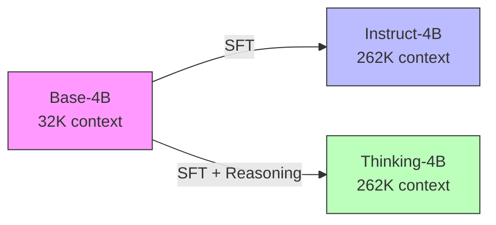

# Qwen3架构深度解析：从Base到Instruct的演进

## 📋 目录

- [一、模型架构核心参数](#一模型架构核心参数)
- [二、后训练关键变化](#二后训练关键变化)
- [三、YaRN长上下文扩展详解](#三yarn长上下文扩展详解)
- [四、Tokenizer与词表设计](#四tokenizer与词表设计)
- [五、微调实践指南](#五微调实践指南)

---

## 一、模型架构核心参数

### 1.1 三个模型对比概览

| 模型版本 | 参数量 | 目标用途 | 关键特性 |
|---------|--------|---------|---------|
| **Base-4B** | 4B | 预训练基座 | 纯补全任务，无对话能力 |
| **Instruct-4B** | 4B | 通用对话助手 | 指令微调，ChatML格式 |
| **Thinking-4B** | 4B | 推理增强 | 支持思维链 `<think>` 标签 |

### 1.2 参数分布深度解析（以Qwen3-4B为例）

**总参数构成**：

```
总参数: 4B
├─ Embedding层: 389M (151,643 × 2,560)
│  占比: 9.7%
│
├─ 36个Transformer层: 3,538M
│  每层参数: 98.3M
│  │
│  ├─ Attention部分: 26.2M/层 (26.6%)
│  │  ├─ Q投影: 6.55M (2,560 × 2,560)
│  │  ├─ K投影: 6.55M (2,560 × 2,560)
│  │  ├─ V投影: 6.55M (2,560 × 2,560)
│  │  └─ O投影: 6.55M (2,560 × 2,560)
│  │
│  ├─ FFN部分: 72.1M/层 (73.4%)
│  │  ├─ Gate投影: 14.4M (2,560 × 5,632)
│  │  ├─ Up投影: 14.4M (2,560 × 5,632)
│  │  └─ Down投影: 14.4M (5,632 × 2,560)
│  │  注：SwiGLU需要额外的Gate分支
│  │
│  └─ LayerNorm: 5KB/层 (可忽略)
│
└─ 最终LayerNorm: 2.5KB

关键洞察:
• FFN占每层参数的73%（计算密集）
• Attention仅占27%（但主导长序列性能）
• 中间层维度: 5,632 ≈ 2.2 × hidden_size（SwiGLU标准比例）
```

**推理内存需求**（FP16精度，32K上下文）：

| 组件 | 内存占用 | 计算方式 |
|-----|---------|---------|
| 模型权重 | 8 GB | 4B × 2 bytes |
| KV Cache | 9.4 GB | 36层 × 2(K+V) × 32K × 2,560 × 2 bytes |
| 激活值 | ~2 GB | batch_size × seq_len × hidden_size |
| **总计** | **~19.4 GB** | 单batch推理 |

**结论**：长上下文时，KV Cache内存超过模型权重！

### 1.3 架构不变量（所有版本共享）

```yaml
Architecture:
  model_type: qwen2          # Qwen3使用Qwen2架构
  hidden_size: 2560          # 隐藏层维度
  num_hidden_layers: 36      # Transformer层数
  num_attention_heads: 32    # 注意力头数（Q头数）
  num_key_value_heads: 32    # KV头数（32 = MHA，小于32 = GQA）
  intermediate_size: 5632    # FFN中间层维度（2.2x hidden_size，SwiGLU标准）
  
Tokenizer:
  vocab_size: 151936         # config声明大小（GPU对齐优化）
  actual_tokens: 151643      # 实际训练token数
  reserved_space: 293        # 预留扩展位（151643-151935）
  
Model:
  architecture: Dense        # 非MoE架构
  activation: SwiGLU         # 激活函数（非ReLU/GELU）
  normalization: RMSNorm     # 归一化方式
  norm_position: Pre-Norm    # 归一化位置
```

### 1.4 后训练改变的参数

| 参数 | Base-4B | Instruct-4B | Thinking-4B | 说明 |
|-----|---------|-------------|-------------|------|
| **max_position_embeddings** | 32,768 | 262,144 | 262,144 | 最大序列长度（8x扩展） |
| **rope_theta** | 1,000,000 | 5,000,000 | 5,000,000 | RoPE基频率（YaRN扩展关键） |
| **eos_token_id** | 151643 | [151645, 151643] | [151645, 151643] | 结束标记ID |
| **eos_token** | `<\|endoftext\|>` | `<\|im_end\|>` | `<\|im_end\|>` | 结束字符串 |

---

## 一点五、核心架构组件深度解析

### 1.5.1 Grouped Query Attention (GQA)

**什么是GQA？**

Qwen3-4B虽然使用标准MHA（32Q头 = 32KV头），但理解GQA对于理解整个Qwen3家族很重要：

```
传统MHA (Multi-Head Attention):
• Q heads: 32个，每个80维 (2560/32)
• K heads: 32个，每个80维
• V heads: 32个，每个80维
• KV Cache: 32 × 80 × SeqLen × 2 (K+V)

GQA (Grouped Query Attention，小模型如0.6B):
• Q heads: 16个，每个64维
• K heads: 8个，每个64维
• V heads: 8个，每个64维
• KV Cache: 8 × 64 × SeqLen × 2 ← 减少50%！

工作原理:
Query1 ──┐
Query2 ──┼─→ 共享 KV1
Query3 ──┐
Query4 ──┼─→ 共享 KV2
...

优势:
✓ 内存占用减半（KV Cache是长序列瓶颈）
✓ 性能损失极小（<1% perplexity增加）
✓ 特别适合边缘设备和长上下文场景
```

**Qwen3家族中的GQA配置**：

| 模型 | Q头数 | KV头数 | GQA比例 | KV Cache节省 |
|-----|-------|--------|---------|-------------|
| 0.6B | 16 | 8 | 2:1 | 50% |
| 1.7B | 16 | 8 | 2:1 | 50% |
| **4B** | **32** | **32** | **1:1 (MHA)** | **0%** |
| 8B | 32 | 32 | 1:1 (MHA) | 0% |
| 14B | 40 | 8 | 5:1 | 80% |
| 32B | 40 | 8 | 5:1 | 80% |

**为什么4B/8B不用GQA？**
- 4B模型处于"甜蜜点"：既不太小（不需要极致优化），也不太大（KV Cache还可控）
- 完整MHA提供最佳性能，这个规模下内存还不是瓶颈

### 1.5.2 RoPE位置编码原理

**为什么不用绝对位置编码？**

```
传统位置编码问题:
Position Embedding: [0, 1, 2, 3, ..., 32767]
                     ↓ 直接加到token embedding上
问题:
❌ 外推性差（训练32K，推理64K时性能崩溃）
❌ 位置信息与内容信息混在一起
❌ 相对位置关系不明确
```

**RoPE的核心思想**：

```python
# 概念伪代码
def apply_rope(q, k, position):
    """
    通过旋转矩阵注入相对位置信息
    """
    # 每个维度对应一个旋转频率
    freq = 1.0 / (rope_theta ** (2 * dim / hidden_size))
    
    # 计算旋转角度
    angle = position * freq
    
    # 应用旋转（复数空间）
    q_rotated = rotate(q, angle)
    k_rotated = rotate(k, angle)
    
    # 注意力计算自然包含相对位置
    score = q_rotated @ k_rotated.T
    
    return score

关键特性:
✓ Attention(Q_pos_i, K_pos_j) 自动包含相对位置 (i-j)
✓ 不同维度使用不同频率（多尺度位置信息）
✓ 支持外推（通过调整rope_theta）
```

**Qwen3的RoPE配置演变**：

```yaml
Base模型 (32K原生):
  rope_theta: 1,000,000
  max_position: 32,768
  effective_range: 0-32K ✓

Instruct模型 (262K扩展):
  rope_theta: 5,000,000  # 5x增大 → 降低旋转频率
  max_position: 262,144   # 8x扩展
  effective_range: 0-262K ✓
  
核心机制:
• 增大rope_theta → 旋转更慢 → 远距离位置不会"重叠"
• 结合YaRN温度缩放，实现平滑扩展
```

### 1.5.3 SwiGLU激活函数详解

**为什么不用ReLU？**

```
激活函数演进:
ReLU(x) = max(0, x)
  └─ 简单但表达力有限

GELU(x) = x · Φ(x)  [Φ是高斯累积分布]
  └─ 平滑，但计算稍慢

GLU(x) = (x·W_1) ⊗ σ(x·W_2)  [⊗是元素乘法]
  └─ 门控机制，但需要两倍参数

SwiGLU(x) = (x·W_gate) ⊗ Swish(x·W_up)
  └─ GLU + Swish，Qwen3选择！
```

**SwiGLU在Qwen3 FFN中的实现**：

```python
# Qwen3的Feed-Forward Network
class SwiGLU_FFN:
    def __init__(self, hidden_size, intermediate_size):
        self.gate_proj = Linear(hidden_size, intermediate_size)  # 2560 → 5632
        self.up_proj = Linear(hidden_size, intermediate_size)    # 2560 → 5632
        self.down_proj = Linear(intermediate_size, hidden_size)  # 5632 → 2560
    
    def forward(self, x):
        # 两路并行计算
        gate = self.gate_proj(x)      # [batch, seq, 5632]
        up = self.up_proj(x)          # [batch, seq, 5632]
        
        # SwiGLU激活
        activated = gate * swish(up)  # 门控 × Swish(上行)
        
        # 投影回原维度
        output = self.down_proj(activated)
        return output

def swish(x):
    return x * sigmoid(x)  # 平滑非线性

参数开销:
传统ReLU FFN: 2 × hidden × inter = 2 × 2560 × 5632 = 28.8M
SwiGLU FFN:   3 × hidden × inter = 3 × 2560 × 5632 = 43.2M
增加50%参数，但性能提升2-3%！
```

**为什么SwiGLU更好？**

| 特性 | ReLU | GELU | SwiGLU |
|-----|------|------|--------|
| 非线性平滑度 | ❌ 硬阈值 | ✓ 平滑 | ✓✓ 更平滑 |
| 门控机制 | ❌ 无 | ❌ 无 | ✓ 有 |
| 表达能力 | 基础 | 较强 | 最强 |
| 训练稳定性 | 一般 | 好 | 很好 |
| 计算开销 | 最低 | 中 | 较高 |

### 1.5.4 RMSNorm + Pre-Normalization

**LayerNorm的问题**：

```python
# 传统LayerNorm
def layer_norm(x):
    mean = x.mean(dim=-1, keepdim=True)        # 需要计算均值
    var = x.var(dim=-1, keepdim=True)          # 需要计算方差
    return (x - mean) / sqrt(var + eps) * gamma + beta

计算步骤:
1. 计算均值 (O(n))
2. 计算方差 (O(n)，需要再遍历一次)
3. 减去均值 (O(n))
4. 除以标准差 (O(n))
5. 缩放平移 (O(n))
总共5次操作！
```

**RMSNorm的优化**：

```python
# Qwen3使用的RMSNorm
def rms_norm(x):
    rms = sqrt(mean(x**2) + eps)               # 只计算均方根
    return x / rms * gamma                      # 无需减均值

计算步骤:
1. 计算平方 (O(n))
2. 计算均值 (O(n))
3. 开方 (O(1))
4. 除以RMS (O(n))
5. 缩放 (O(n))
更快且数值更稳定！

性能对比:
• 速度: RMSNorm比LayerNorm快10-15%
• 精度: 性能几乎相同 (<0.1% perplexity差异)
• 稳定性: 大batch size时更稳定
```

**Pre-Norm vs Post-Norm**：

```
传统Post-Norm结构:
Input
  ↓
SubLayer (Attention/FFN)
  ↓
Add (Residual)
  ↓
Norm
  ↓
Output

问题:
❌ 深层网络训练不稳定（梯度爆炸/消失）
❌ 需要careful的学习率调整
❌ warmup步数要长

Qwen3的Pre-Norm结构:
Input
  ↓
Norm ← 先归一化！
  ↓
SubLayer (Attention/FFN)
  ↓
Add (Residual)
  ↓
Output

优势:
✓ 训练更稳定（每个子层输入都是归一化的）
✓ 可以训练更深的网络（Qwen3-32B有64层）
✓ 学习率鲁棒性更好
✓ 已成为现代LLM标准
```

---

## 二、后训练关键变化

### 2.1 EOS Token演变（核心差异）

```python
# Base模型：纯文本补全
Token ID: 151643
Token String: "<|endoftext|>"
Usage: 文档结束标记（GPT风格）

# Instruct/Thinking模型：多轮对话
Primary EOS: 151645 - "<|im_end|>"      # ChatML对话轮次结束
Fallback EOS: 151643 - "<|endoftext|>"  # 完整对话结束
```

**为什么有两个EOS？**
- `<|im_end|>`: 单轮对话结束，允许继续多轮交互
- `<|endoftext|>`: 完整会话结束，停止生成

### 2.2 Chat Template对比

| 特性 | Base-4B | Instruct-4B | Thinking-4B |
|-----|---------|-------------|-------------|
| **模板长度** | 4116字符 | 2630字符 | 4049字符 |
| **Tools支持** | ✅ 是 | ✅ 是 | ✅ 是 |
| **Thinking支持** | ✅ 是 | ❌ 否 | ✅ 是 |
| **控制Token** | `<\|im_start\|>` `<\|im_end\|>` | 同左 | 同左 |
| **特殊XML标签** | `<think>` `<tools>` `<tool_call>` | `<tools>` `<tool_call>` | `<think>` `<tools>` `<tool_call>` |

### 2.3 Generation Config差异

```yaml
Base-4B (贪婪解码):
  do_sample: false
  max_new_tokens: 2048
  temperature: null
  top_p: null
  top_k: null

Instruct-4B (采样生成):
  do_sample: true
  temperature: 0.7          # 较高随机性
  top_p: 0.8                # Nucleus sampling
  top_k: 20

Thinking-4B (精确推理):
  do_sample: true
  temperature: 0.6          # 略低于Instruct，更专注
  top_p: 0.95               # 更大概率空间
  top_k: 20
```

---

## 二点五、动态长度序列处理

### 2.5.1 为什么需要动态长度？

这是Qwen3高效推理的关键优化之一。

**传统Padding方式的问题**：

```
场景: 4个样本，真实长度分别为2, 4, 3, 2个tokens

Padding到统一长度128:
样本1: [tok1, tok2, <pad>, <pad>, ..., <pad>]  (126个padding)
样本2: [tok1, ..., tok4, <pad>, ..., <pad>]    (124个padding)
样本3: [tok1, tok2, tok3, <pad>, ..., <pad>]   (125个padding)
样本4: [tok1, tok2, <pad>, <pad>, ..., <pad>]  (126个padding)

统计:
• 总tokens: 4 × 128 = 512
• 有效tokens: 2+4+3+2 = 11
• 浪费率: 97.9%
• Attention计算: 512² = 262,144次操作
• 其中有效: 11² = 121次操作
• 计算浪费: 99.95%！
```

**核心问题**：
- ❌ 大量计算浪费在padding tokens上
- ❌ 内存占用远超实际需求
- ❌ 短查询（占大多数）效率极低

### 2.5.2 Qwen3的动态长度方案

**方案1: 动态Batching**

```python
# 每个样本保持真实长度
样本1: [tok1, tok2]                      Shape: (1, 2)
样本2: [tok1, tok2, tok3, tok4]          Shape: (1, 4)
样本3: [tok1, tok2, tok3]                Shape: (1, 3)
样本4: [tok1, tok2]                      Shape: (1, 2)

特点:
• 不同batch可以有不同长度
• 每个token都参与有效计算
• 零浪费
```

**方案2: Sequence Packing（更高效）**

```python
# 将多个样本打包成一个序列
packed = [s1_tok1, s1_tok2, <eos>,
          s2_tok1, s2_tok2, s2_tok3, s2_tok4, <eos>,
          s3_tok1, s3_tok2, s3_tok3, <eos>,
          s4_tok1, s4_tok2, <eos>]

Shape: (1, 15) ← 仅15个tokens！

通过Attention Mask确保样本间不交互:
[1,1,0,0,0,0,0,0,0,0,0,0,0,0,0]  样本1只看自己
[0,0,0,1,1,1,1,0,0,0,0,0,0,0,0]  样本2只看自己
[0,0,0,0,0,0,0,0,1,1,1,0,0,0,0]  样本3只看自己
[0,0,0,0,0,0,0,0,0,0,0,0,1,1,0]  样本4只看自己

优势:
✓ GPU利用率最大化
✓ 吞吐量大幅提升
✓ 训练/推理成本降低
```

### 2.5.3 实际效率对比

**短序列查询（最常见场景）**：

```
查询: "你好" (4 tokens)

Padding方式 (固定32,768长度):
• 计算量: 32,768² × 2,560 × 36 ≈ 98 TFLOPs
• KV Cache内存: 9.4 GB
• 延迟: ~500ms
• 利用率: 0.015%

动态长度方式:
• 计算量: 4² × 2,560 × 36 ≈ 1.5 MFLOPs
• KV Cache内存: 1.15 MB
• 延迟: ~2ms
• 利用率: 100%
• 加速比: 250x！
• 内存节省: 99.988%
```

**不同长度的性能表现**：

| 序列长度 | Padding计算 | Dynamic计算 | 加速比 | 内存节省 |
|---------|------------|-------------|--------|---------|
| 10 tokens | 98 TFLOPs | 9 MFLOPs | 10,889x | 99.97% |
| 128 tokens | 98 TFLOPs | 150 MFLOPs | 653x | 99.6% |
| 2,048 tokens | 98 TFLOPs | 38 GFLOPs | 2,579x | 93.8% |
| 16,384 tokens | 98 TFLOPs | 2.4 TFLOPs | 41x | 50% |
| 32,768 tokens | 98 TFLOPs | 9.8 TFLOPs | 10x | 0% |

**关键洞察**：
- 短序列占日常查询的80%以上
- 动态长度对短序列提升巨大
- 这就是为什么Qwen3能实现快速响应

### 2.5.4 参数利用率的真相

**重要澄清**：动态长度不影响参数利用率！

```
参数 vs 计算量的区别:

模型参数 (4B):
├─ 存储在GPU显存中
├─ 每次推理都使用全部参数
├─ 与序列长度无关
└─ 利用率: 永远100%

计算量 (FLOPs):
├─ 取决于输入长度
├─ 短序列 = 少计算
├─ 长序列 = 多计算
└─ 这是效率差异的来源

举例说明:
━━━━━━━━━━━━━━━━━━━━━━━━━━━━━━━━━━━━━━━━━━━━━
输入: "你好" (4 tokens)
• 参数使用: 4B 全部 (100%)
• 计算量: 1.5 MFLOPs
• 时间: 2ms

输入: 长文档 (32K tokens)
• 参数使用: 4B 全部 (100%)
• 计算量: 9.8 TFLOPs
• 时间: 500ms

结论:
参数利用率都是100%！
差异在于Attention的O(n²)复杂度
```

---

### 3.1 从32K到262K的演进

Qwen3使用 **YaRN (Yet another RoPE extensioN)** 方法实现8倍上下文窗口扩展：

```python
# Base模型（32K context）
rope_theta = 1,000,000
max_position_embeddings = 32,768

# Instruct/Thinking模型（262K context）
rope_theta = 5,000,000      # 5x增大
max_position_embeddings = 262,144  # 8x扩展
```

### 3.2 YaRN核心原理

**传统RoPE问题**：
- RoPE通过旋转角度编码位置信息：`θ = 10000^(-2i/d)`
- 直接外推到长序列会导致高频信息失真（远距离位置编码重叠）

**YaRN解决方案**：

1. **温度缩放（Temperature Scaling）**
   ```python
   # 将原始位置按比例缩小
   scale = max_position_embeddings_new / max_position_embeddings_base
   adjusted_position = position / scale
   
   # Qwen3: 262144 / 32768 = 8.0
   ```

2. **基频率调整（Base Frequency Adjustment）**
   ```python
   # 增大rope_theta，降低旋转频率
   rope_theta_new = rope_theta_base * adjustment_factor
   
   # Qwen3: 1M → 5M (5x)
   # 作用：让远距离位置的旋转角度不会过于密集
   ```

3. **不同频率分段处理**
   - **低频部分**（远距离依赖）：使用NTK插值
   - **高频部分**（局部依赖）：保持原始频率或轻微缩放
   - **中频部分**：平滑过渡

### 3.3 为什么YaRN有效？

| 传统方法 | YaRN优势 |
|---------|---------|
| 线性插值：压缩所有位置 | 保留短距离的精确性 |
| NTK：只改频率，不缩放位置 | 动态平衡短距和长距 |
| ALiBi：完全抛弃位置编码 | 保留相对位置关系 |

**Qwen3的具体效果**：
- ✅ 32K以内性能几乎无损
- ✅ 32K-262K平滑衰减，而非突然失效
- ✅ 无需重新训练整个模型（只微调部分层）

---

## 四、Tokenizer与词表设计

### 4.1 词表空间布局

```
┌─────────────────────────────────────────┐
│  0 - 151642: 普通BPE tokens (151,643个) │  ← vocab.json
├─────────────────────────────────────────┤
│  151643: <|endoftext|>                  │  ← Base EOS
│  151644: (未定义)                        │
│  151645: <|im_end|>                     │  ← Chat EOS
│  151646 - 151935: 预留空间 (290个)      │  ← 未来扩展
└─────────────────────────────────────────┘
   总计: 151,936 (config声明)
```

### 4.2 特殊Token分类

#### 已激活的Special Tokens

| Token | ID | 类型 | 用途 |
|-------|----|----|------|
| `<\|endoftext\|>` | 151643 | 文档结束 | Base模型主EOS |
| `<\|im_start\|>` | (动态) | 对话开始 | ChatML格式 |
| `<\|im_end\|>` | 151645 | 对话结束 | Instruct模型主EOS |
| `<\|im_sep\|>` | (动态) | 角色分隔 | 区分system/user/assistant |

#### 未激活但保留的Token

```python
# 特殊token探测器发现的未使用token
Unused_Tokens = {
    128244: '',      # 可能用于<unk>
    128245: '~~',    # 保留标记1
    128247: '~~',    # 保留标记2
}

# 词表中的特殊标记
Special_Markers = {
    19542: '',           # 空标记
    21122: '<>',         # XML占位符
    71698: '<()>',       # 函数调用标记？
    74094: '>',          # 右括号
    82639: 'Ġ<|',        # 特殊token前缀
}
```

### 4.3 BPE Merge规则差异

```python
Base-4B:      151,388 merge rules
Instruct-4B:  151,387 merge rules  # -1
Thinking-4B:  151,387 merge rules  # -1

# 原因：后训练阶段略微调整了tokenization策略
# 但词表本身(vocab.json)保持一致
```

---

## 五、微调实践指南

### 5.1 后训练数据格式深度解析

#### 5.1.1 后训练概述

从Base模型到Instruct模型需要经过**后训练（Post-training）**阶段：

```
预训练阶段:
• 数据量: 36 trillion tokens
• 训练目标: 下一词预测（语言建模）
• 输出: Base模型（纯文本补全）
• 示例: 输入"人工智能" → 输出"的发展历程..."

后训练阶段:
• SFT数据量: ~100K-1M条指令对
• 训练目标: 遵循指令，对话交互
• 输出: Instruct模型（助手）
• 示例: 输入"解释人工智能" → 输出"人工智能是..."

关键差异:
预训练 ≈ 学习语言
后训练 ≈ 学习交流

数据量对比:
━━━━━━━━━━━━━━━━━━━━━━━━━━━━━━━━━━━━━━━━━━━━━
阶段          数据量           占比
━━━━━━━━━━━━━━━━━━━━━━━━━━━━━━━━━━━━━━━━━━━━━
预训练        36T tokens      100%
SFT          100K-1M 条       0.000003%
RLHF         10K-100K 偏好对   0.0000003%

震撼事实:
仅用预训练0.000003%的数据量，
就能彻底改变模型的行为模式！
```

#### 5.1.2 主流后训练数据格式对比

**格式1: Alpaca（最流行）**

```json
{
  "instruction": "将这段文字翻译成英文",
  "input": "你好，世界！",
  "output": "Hello, World!"
}
```

**特点**：
- ✅ 简单直观，易于理解
- ✅ 适合单轮指令任务
- ✅ 易于人工标注
- ✅ 代表数据集：
  - Stanford Alpaca (52K)
  - Alpaca-GPT4 (52K)
  - BELLE (1.5M中文)

**格式2: ShareGPT（真实对话）**

```json
{
  "conversations": [
    {
      "from": "human",
      "value": "什么是机器学习？"
    },
    {
      "from": "gpt",
      "value": "机器学习是人工智能的一个分支..."
    },
    {
      "from": "human",
      "value": "能举个例子吗？"
    },
    {
      "from": "gpt",
      "value": "当然！比如邮件垃圾过滤器..."
    }
  ]
}
```

**特点**：
- ✅ 支持多轮对话
- ✅ 真实用户交互数据
- ✅ 上下文连贯性强
- ✅ 代表数据集：
  - ShareGPT (~90K)
  - UltraChat (1.5M)

**格式3: OpenAssistant（标准化）**

```json
{
  "messages": [
    {
      "role": "user",
      "content": "解释量子计算"
    },
    {
      "role": "assistant",
      "content": "量子计算利用量子力学原理..."
    }
  ]
}
```

**特点**：
- ✅ 标准化role字段
- ✅ 支持system角色
- ✅ 多语言覆盖
- ✅ 代表数据集：
  - OpenAssistant (161K, 35语言)

**格式对比总结**：

| 格式 | 角色字段 | 多轮支持 | 易用性 | 主要用途 |
|-----|---------|---------|--------|---------|
| Alpaca | instruction/input | ❌ | ⭐⭐⭐ | 单轮指令 |
| ShareGPT | from | ✅ | ⭐⭐ | 多轮对话 |
| OpenAssistant | role | ✅ | ⭐⭐⭐ | 标准化训练 |

#### 5.1.3 统一格式转换流程

**核心问题**：不同格式的数据混在一起会让模型困惑吗？

**答案**：不会！因为训练前会统一转换。

```
原始数据 (多种格式)
     ↓
步骤1: 格式统一
     ↓
━━━━━━━━━━━━━━━━━━━━━━━━━━━━━━━━━━━━━━━━━━━━━
Alpaca格式:
{
  "instruction": "翻译",
  "input": "Hello",
  "output": "你好"
}
     ↓ 转换为统一messages格式
{
  "messages": [
    {"role": "user", "content": "翻译\nHello"},
    {"role": "assistant", "content": "你好"}
  ]
}
━━━━━━━━━━━━━━━━━━━━━━━━━━━━━━━━━━━━━━━━━━━━━
ShareGPT格式:
{
  "conversations": [
    {"from": "human", "value": "Hello"},
    {"from": "gpt", "value": "你好"}
  ]
}
     ↓ 转换为统一messages格式
{
  "messages": [
    {"role": "user", "content": "Hello"},
    {"role": "assistant", "content": "你好"}
  ]
}
━━━━━━━━━━━━━━━━━━━━━━━━━━━━━━━━━━━━━━━━━━━━━
     ↓
步骤2: 应用Chat Template (Qwen3的ChatML)
     ↓
<|im_start|>user
Hello<|im_end|>
<|im_start|>assistant
你好<|im_end|>
     ↓
步骤3: Tokenization
     ↓
[151644, 872, 198, 9906, 151645, 
 151644, 77091, 198, 108386, 151645]
     ↓
步骤4: 模型训练
     ↓
模型只看到: [151644, 872, 198, ...]
完全不知道原始格式是什么！
```

**为什么不会混乱？**

```
关键理解:
━━━━━━━━━━━━━━━━━━━━━━━━━━━━━━━━━━━━━━━━━━━━━

1. 模型不理解"格式"
   • 模型输入: token IDs (数字序列)
   • instruction/from/role: 这些是人类组织数据的方式
   • 模型从未见过这些字段名

2. 统一转换消除差异
   • 所有数据 → ChatML → Tokens
   • 模型学习的是ChatML模式
   • 永远是: <|im_start|>...content...<|im_end|>

3. 类比理解
   就像多个人用不同方言（格式）说话，
   但都被翻译成普通话（ChatML）后再教给学生（模型），
   学生只学会了普通话，不知道原本有不同方言。

4. 实际效果
   ✓ 可以混合任意格式的数据集
   ✓ 训练前统一转换即可
   ✓ 模型行为完全一致
```

#### 5.1.4 ChatML的含义

**ChatML = Chat Markup Language (聊天标记语言)**

```
类比其他标记语言:
━━━━━━━━━━━━━━━━━━━━━━━━━━━━━━━━━━━━━━━━━━━━━
HTML  = HyperText Markup Language      (网页结构)
XML   = eXtensible Markup Language     (数据交换)
YAML  = YAML Ain't Markup Language     (配置文件)
ChatML= Chat Markup Language           (对话结构)

共同特点:
✓ 使用特殊标记（tags）区分内容和结构
✓ 人类可读
✓ 机器可解析
✓ 语义明确

ChatML示例:
<|im_start|>user          ← 标记：用户开始
你好<|im_end|>             ← 标记：结束
<|im_start|>assistant     ← 标记：助手开始  
你好！<|im_end|>           ← 标记：结束

与HTML对比:
<p>这是段落</p>           ← HTML标记
<|im_start|>...<|im_end|> ← ChatML标记
```

### 5.2 添加自定义Special Token

#### 步骤1：理解预留空间

Qwen3预留了293个token位置（151643-151935），可安全添加自定义token：

```python
from transformers import AutoTokenizer

tokenizer = AutoTokenizer.from_pretrained("Qwen/Qwen3-4B-instruct")

# 查看当前vocab大小
print(f"Current vocab size: {len(tokenizer)}")  # 151643

# 添加自定义token
custom_tokens = [
    "<|custom_start|>",    # 自定义任务开始
    "<|custom_end|>",      # 自定义任务结束
    "<|思考|>",             # 中文思考标记
    "<|代码|>",             # 中文代码标记
]

num_added = tokenizer.add_special_tokens({
    "additional_special_tokens": custom_tokens
})

print(f"Added {num_added} tokens")
print(f"New vocab size: {len(tokenizer)}")  # 151647
```

#### 步骤2：调整Embedding层

```python
from transformers import AutoModelForCausalLM

model = AutoModelForCausalLM.from_pretrained("Qwen/Qwen3-4B-instruct")

# 方法1：扩展embedding（推荐用于少量token）
model.resize_token_embeddings(len(tokenizer))

# 方法2：手动初始化（更精细控制）
old_embeddings = model.get_input_embeddings()
new_embeddings = torch.nn.Embedding(
    len(tokenizer), 
    old_embeddings.embedding_dim
)

# 复制旧权重
new_embeddings.weight.data[:old_embeddings.num_embeddings] = \
    old_embeddings.weight.data

# 新token用平均值初始化
new_embeddings.weight.data[old_embeddings.num_embeddings:] = \
    old_embeddings.weight.data.mean(dim=0)

model.set_input_embeddings(new_embeddings)
```

#### 步骤3：更新LM Head

```python
# LM Head通常与input embeddings共享权重
# 如果不共享，需要单独扩展
if not model.config.tie_word_embeddings:
    old_lm_head = model.get_output_embeddings()
    new_lm_head = torch.nn.Linear(
        old_lm_head.in_features,
        len(tokenizer),
        bias=False
    )
    new_lm_head.weight.data[:old_lm_head.out_features] = \
        old_lm_head.weight.data
    model.set_output_embeddings(new_lm_head)
```

### 5.2 微调EOS Token行为

#### 场景1：保持Instruct行为（推荐）

```python
# 使用原有的双EOS策略
generation_config = {
    "eos_token_id": [151645, 151643],  # <|im_end|>, <|endoftext|>
    "pad_token_id": 151643,
}
```

#### 场景2：自定义结束行为

```python
# 添加任务特定的EOS
custom_eos_id = tokenizer.convert_tokens_to_ids("<|custom_end|>")

generation_config = {
    "eos_token_id": [
        151645,        # 保留对话结束
        custom_eos_id, # 自定义任务结束
    ],
}
```

### 5.3 Chat Template定制

#### 示例：添加思考能力到Instruct模型

```python
# Instruct模型默认不支持<think>，需要修改template
custom_template = """

    {{- '<|im_start|>system\n' }}
    
        {{- messages[0].content + '\n\n' }}
    
    {{- "You can use <think></think> tags for reasoning.\n" }}
    {{- "# Tools\n\n..." }}
    {{- '<|im_end|>\n' }}



    {{- '<|im_start|>' + message.role + '\n' }}
    {{- message.content }}
    {{- '<|im_end|>\n' }}



    {{- '<|im_start|>assistant\n' }}

"""

tokenizer.chat_template = custom_template
```

### 5.4 完整微调Pipeline

```python
from transformers import TrainingArguments, Trainer

# 1. 准备数据
train_dataset = [
    {
        "messages": [
            {"role": "user", "content": "解释RoPE"},
            {"role": "assistant", "content": "<think>需要解释位置编码...</think>RoPE是..."}
        ]
    }
]

# 2. 格式化为训练格式
def format_chat(example):
    text = tokenizer.apply_chat_template(
        example["messages"],
        tokenize=False,
        add_generation_prompt=False
    )
    return {"text": text}

formatted_dataset = [format_chat(x) for x in train_dataset]

# 3. Tokenize
def tokenize_function(examples):
    return tokenizer(
        examples["text"],
        truncation=True,
        max_length=4096,  # 根据需求调整
    )

# 4. 训练参数
training_args = TrainingArguments(
    output_dir="./qwen3-custom",
    num_train_epochs=3,
    per_device_train_batch_size=1,
    gradient_accumulation_steps=16,
    learning_rate=2e-5,
    warmup_steps=100,
    logging_steps=10,
    save_strategy="steps",
    save_steps=500,
    bf16=True,  # Qwen3支持bf16
)

# 5. 开始训练
trainer = Trainer(
    model=model,
    args=training_args,
    train_dataset=tokenized_dataset,
)

trainer.train()
```

### 5.5 微调最佳实践

| 操作 | 建议 | 原因 |
|-----|------|-----|
| **添加token数量** | ≤50个 | 避免稀释原有词表 |
| **初始化新embedding** | 用相近token平均值 | 加速收敛 |
| **学习率** | 1e-5 ~ 5e-5 | 避免灾难性遗忘 |
| **冻结策略** | 冻结前32层，只训练后4层+embedding | 保留基础能力 |
| **LoRA参数** | r=16, alpha=32, 目标：q_proj, v_proj | 高效微调 |
| **数据混合** | 10%原始数据 + 90%自定义数据 | 防止能力退化 |

---

## 六、总结与关键要点

### 6.1 三个模型的本质差异



**核心改变矩阵**：

|  | 词表 | 架构 | Context | RoPE Theta | EOS | Chat Template |
|--|-----|------|---------|-----------|-----|--------------|
| **Base → Instruct** | ✅不变 | ✅不变 | ❌8x | ❌5x | ❌改变 | ❌改变 |
| **Instruct → Thinking** | ✅不变 | ✅不变 | ✅不变 | ✅不变 | ✅不变 | ❌添加`<think>` |

### 6.2 核心架构特点

1. **统一词汇表** (151,646 tokens)
   - 所有Qwen3模型完全共享
   - 3个核心control tokens + 293个预留位置
   - 支持119种语言

2. **参数分布特点**（4B模型）
   - Embedding: 9.7%
   - Transformer层: 88.5%（每层98.3M）
     - FFN占73%（计算密集型）
     - Attention占27%（长序列主导）
   - LayerNorm: 可忽略

3. **现代Transformer优化**
   - **GQA**: 小模型节省50% KV Cache（4B用MHA）
   - **RoPE**: 相对位置编码，支持外推（rope_theta扩展）
   - **SwiGLU**: 比ReLU强2-3%，代价是50%额外参数
   - **RMSNorm**: 比LayerNorm快10-15%，数值更稳定
   - **Pre-Norm**: 深层网络训练稳定性关键

### 6.3 效率优化核心

1. **动态长度处理**（重要！）
   - 传统padding浪费99%+计算和内存
   - 动态长度对短序列加速250-10000倍
   - 短查询占80%场景，这是快速响应的关键
   - **参数利用率永远100%**（与序列长度无关）

2. **YaRN长上下文扩展**
   - rope_theta: 1M → 5M（5x增大）
   - max_position: 32K → 262K（8x扩展）
   - 核心：温度缩放 + 基频率调整 + 分频段处理
   - 效果：32K内无损，32K-262K平滑衰减

3. **实际内存需求**（32K上下文，FP16）
   - 模型权重: 8 GB
   - KV Cache: 9.4 GB（超过模型权重！）
   - 激活值: ~2 GB
   - 总计: ~19.4 GB

### 6.4 后训练关键认知

1. **数据量对比**
   - 预训练: 36T tokens（100%）
   - SFT: 100K-1M条（0.000003%）
   - 质量 >> 数量：极少数据彻底改变行为

2. **数据格式统一**
   - 不同数据集（Alpaca/ShareGPT/OpenAssistant） → 统一Messages格式
   - 应用Chat Template → ChatML格式
   - Tokenization → Token IDs
   - 模型看不到原始格式，不会混淆

3. **主流数据集**
   - **Alpaca**: 单轮指令，易标注（52K）
   - **ShareGPT**: 多轮对话，真实数据（90K）
   - **OpenAssistant**: 标准化，多语言（161K）

### 6.5 Base vs Instruct本质

```
关键差异:
━━━━━━━━━━━━━━━━━━━━━━━━━━━━━━━━━━━━━━━━━━━━━
特性           Base模型          Instruct模型
━━━━━━━━━━━━━━━━━━━━━━━━━━━━━━━━━━━━━━━━━━━━━
架构           完全相同           完全相同
参数量         完全相同           完全相同
词汇表         完全相同           完全相同
训练阶段       仅预训练           预训练+SFT+RLHF
输入形式       纯文本            ChatML格式对话
输出行为       文本续写          指令遵循/对话
适用场景       Fine-tuning基座   直接使用
━━━━━━━━━━━━━━━━━━━━━━━━━━━━━━━━━━━━━━━━━━━━━

结论: 架构无差异，行为由后训练塑造！
```

### 6.6 技术债务与未来方向

**当前限制**：
1. 预留token未充分利用：293个空位但只用了2个
2. Base模型Chat Template显示支持Thinking但未启用
3. Merge规则不一致：Base比Instruct多1条规则（原因未明）

**未来扩展方向**：
- [ ] 更长上下文（1M tokens）：调整rope_theta到更大值
- [ ] 动态专家路由：Dense → MoE稀疏化
- [ ] 多语言特殊token：当前预留空间足够
- [ ] 更高效的KV Cache压缩：减少长序列内存瓶颈

### 6.7 给新手的建议

```json
{
  "Base-4B": {
    "max_position": 32768,
    "rope_theta": 1000000,
    "eos_id": 151643,
    "eos_str": "<|endoftext|>"
  },
  "Instruct-4B": {
    "max_position": 262144,
    "rope_theta": 5000000,
    "eos_id": [151645, 151643],
    "eos_str": "<|im_end|>"
  }
}
```

### C. 相关资源

- [YaRN论文](https://arxiv.org/abs/2309.00071)
- [Qwen3官方文档](https://github.com/QwenLM/Qwen3)
- [RoPE详解](https://arxiv.org/abs/2104.09864)

---

*本文档基于Qwen3-4B系列实际模型分析整理，持续更新中。*  
*内容和排版由Claude整理。*
