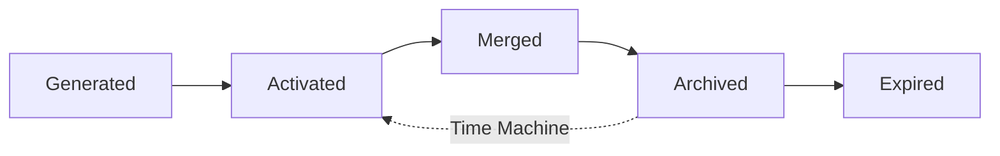

## 概述

**MemOS** 提出首个LLM记忆操作系统，将记忆提升为系统级资源。**参数化记忆**（Parameter Memory）作为三大记忆类型之一，是嵌入模型权重的长期知识载体。本文聚焦其管理策略创新：通过LoRA/Adapter轻量化更新、精准编辑技术、动态跨类型转换，实现高效知识内化与演化。

---

## 一、参数化记忆核心定义

### 1.1 本质与表现
- **定义**：编码在模型固定权重中的知识和能力
- **存储位置**：
  - 前馈层权重：$W^l_{\text{MLP}}$
  - 注意力矩阵：$W^l_K, W^l_V$
- **知识类型**：
  - 语法结构
  - 概念关系（如"巴黎是法国首都"）
  - 常识推理模式

### 1.2 优劣对比

| 维度 | 优势 | 劣势 |
|------|------|------|
| **推理** | 零样本能力、无需检索 | 更新成本极高（需重训练） |
| **效率** | 泛化强、响应快 | 灾难性遗忘风险 |
| **可控性** | 深度语义表达 | 黑盒不透明、难定制 |

---

## 二、MemOS的参数记忆管理策略

### 2.1 形成机制三路径

#### (1) 预训练与后训练
- **预训练**：大规模语料重构知识分布（GPT系列）
- **后训练**：RLHF对齐、指令微调（InstructGPT）
- **显式记忆训练**：
  - **CTRL**：训练数据嵌入控制码，自动关联上下文
  - **SLayer**：识别记忆相关层，局部微调增强特定知识

#### (2) 适配器模块（核心创新）
**问题**：全量微调成本高、易遗忘  
**解决方案**：冻结主干 + 插入轻量模块

| 方法 | 机制 | 优势 |
|------|------|------|
| **LoRA** | 插入低秩矩阵（rank 8-64） | 参数量<1%，快速加载/卸载 |
| **PRAG** | 文档→LoRA适配器→按需合并 | 专用知识单元化 |
| **DyPRAG** | 神经生成器直接输出LoRA参数 | 减少显式存储 |

**MemOS实现**：
```python
# 伪代码示例
capability_modules = {
    "legal_expert": LoRA(rank=16, target_layers=["q_proj", "v_proj"]),
    "medical_advisor": LoRA(rank=32, domain="clinical"),
    "style_generator": Adapter(bottleneck_dim=64)
}
MemScheduler.load_module(task="contract_review", module="legal_expert")
```

#### (3) 参数编辑技术
**目标**：定向修改事实知识，保留原有能力

三大技术路线：

| 类型 | 代表方法 | 原理 | 适用场景 |
|------|---------|------|---------|
| **定位-编辑** | ROME, MEMIT | 因果追踪→精准层级更新 | 单一事实修正 |
| **元学习** | - | 超网络预测参数变化 | 批量编辑 |
| **适配器式** | SERAC, GRACE | 保留主干+编辑模块 | 可控编辑 |

**案例**：修正"美国总统是谁？"
```
1. 因果追踪定位存储层（通常在中间FFN层）
2. 计算梯度更新目标："Joe Biden" → "Donald Trump"
3. 约束更新范围，避免干扰其他知识
```

### 2.2 MemOS中的生命周期管理

#### 五态演化模型


- **Generated**：新训练的LoRA模块
- **Activated**：频繁调用的能力模块（如法律推理）
- **Merged**：多个相关模块融合（如医疗诊断+用药指导）
- **Archived**：低频模块冷存储
- **Expired**：过时模块删除（可Time Machine恢复）

#### MemCube封装
每个参数记忆模块封装为MemCube：
```yaml
MemCube_ID: param_legal_expert_v2.3
Metadata:
  - Timestamp: 2025-10-01
  - Origin: Fine-tuned on CaseLaw-10K
  - Access_Control: [legal_team, compliance_bot]
  - TTL: 180 days
  - Priority: High
  - Version_Chain: [v2.0 → v2.1 → v2.3]
Payload:
  - Type: LoRA weights
  - Rank: 16
  - Target_Layers: [q_proj, v_proj, o_proj]
```

---

## 三、跨类型记忆转换策略

### 3.1 转换路径

#### Plaintext → Parameter（知识内化）
**触发条件**：
- 访问频率 > 阈值（如每小时10次）
- 知识结构稳定（版本变化<5%）

**流程**：
1. 高频plaintext（如"患者用药指南"）由MemScheduler标记
2. 使用DyPRAG将文本→LoRA参数
3. 验证准确性后注册为parameter module
4. 原plaintext归档，推理时直接调用参数

**效果**：延迟降低60-80%（避免检索+拼接）

#### Parameter → Plaintext（知识外化）
**触发条件**：
- 知识过时（如旧版法规）
- 需要人工校正
- 跨平台迁移需求

**流程**：
1. MemGovernance检测参数冲突（如与新plaintext矛盾）
2. MemDumper将LoRA权重反向解码为文本摘要
3. 存储到MemVault，标记"待审核"
4. 人工编辑后重新训练或保持plaintext形式

#### Activation ↔ Parameter（能力固化）
**场景**：频繁触发的steering vector固化为参数
```python
# 示例：将"礼貌回复"steering vector内化
steering_vec = extract_from_kv_cache(attribute="polite")
if usage_count(steering_vec) > 1000:
    LoRA_polite = distill(steering_vec)
    MemStore.publish(LoRA_polite, tag="behavior_module")
```

### 3.2 调度策略

**MemScheduler决策树**：
```
if task.type == "dialogue" and context_length > 2K:
    load(Activation_Memory)  # KV-cache优先
elif task.domain in specialized_modules:
    load(Parameter_Memory)   # 能力模块
else:
    load(Plaintext_Memory)   # 灵活检索
```

**自适应触发**：
- 对话连续性任务 → KV-cache
- 程序化任务（代码生成） → 参数模块
- 事实查询 → plaintext检索

---

## 四、应用场景与实践

### 4.1 能力型Agent
**适用领域**：需要深度专业能力的任务

| 场景 | 参数模块配置 | 效果 |
|------|-------------|------|
| **法律顾问** | LoRA训练于CaseLaw+法规 | 合同审查准确率提升22% |
| **财务审计** | Adapter内嵌会计准则 | 自动化审计覆盖率95% |
| **技术写作** | 风格module（API文档风格） | 一致性评分提升至4.6/5.0 |

### 4.2 多模块协同
**场景**：医疗诊断系统
```yaml
Task: 罕见病诊断
Modules:
  - symptom_analyzer (Parameter, LoRA-rank32)
  - drug_interaction_checker (Parameter, Adapter)
  - patient_history (Plaintext, 检索自EHR)
  - recent_guidelines (Plaintext, 更新于2025-09)
  
Workflow:
  1. 症状分析 → 调用parameter模块
  2. 历史对比 → 检索plaintext记忆
  3. 用药建议 → 融合parameter+plaintext
  4. 高频诊断路径 → 固化为新parameter模块
```

### 4.3 个性化能力迁移
**场景**：跨平台专家能力同步
- 用户在ChatGPT训练"学术写作风格"LoRA
- 通过MemDumper导出（加密+水印）
- 在Cursor导入，继续使用相同风格
- MemGovernance确保访问控制

---

## 五、局限性与未来方向

### 5.1 当前挑战
1. **跨模型兼容性**
   - 不同架构（GPT vs Llama）的LoRA不通用
   - 需要Memory Interchange Protocol (MIP)标准

2. **编辑精度与副作用**
   - 单次编辑成功率约70-85%
   - 存在知识泄漏风险（影响相关知识）

3. **计算成本**
   - LoRA训练仍需数小时
   - DyPRAG推理成本高于静态检索

### 5.2 研究方向
- **Self-Evolving Parameter Modules**：基于反馈自动优化
- **Zero-Shot Parameter Editing**：无需梯度更新的编辑
- **Federated Parameter Memory**：去中心化模块共享

---

## 关键技术对比

| 维度 | 传统微调 | LoRA/Adapter | MemOS管理 |
|------|---------|-------------|----------|
| **参数量** | 100% | <1% | 模块化<0.5% |
| **更新速度** | 数天 | 数小时 | 秒级加载/卸载 |
| **遗忘风险** | 高 | 中 | 低（版本控制） |
| **可编辑性** | 困难 | 中等 | 高（支持回滚） |
| **跨任务复用** | 不支持 | 有限 | 完全支持 |

---

## 总结

MemOS通过**操作系统级抽象**重新定义参数化记忆管理：

1. **轻量化**：LoRA/Adapter实现<1%参数量更新
2. **模块化**：能力封装为可插拔MemCube
3. **动态化**：自动跨类型转换（plaintext ↔ parameter）
4. **可控化**：版本管理+Time Machine+权限控制

这标志着从**静态知识嵌入**到**动态能力编排**的范式转变，为构建持续演化的AGI系统奠定基础。

---

**参考文献**：Li et al. (2025). MemOS: A Memory OS for AI System. arXiv:2507.03724v3
